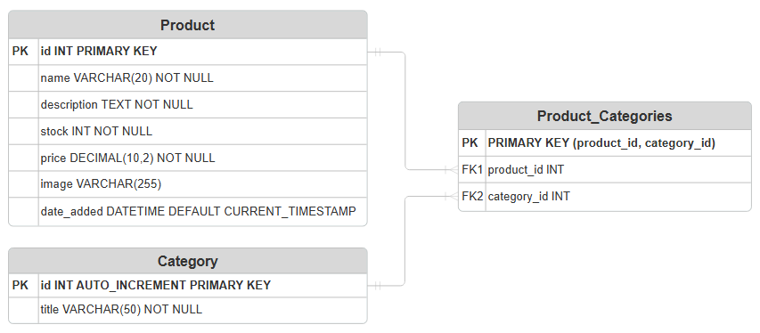

# 🗃️ LevelUp - Product Catalog API
Built a normalized database and RESTful API for the LevelUp e-shop, managing products and categories with full CRUD, multi-category support, search and sort by title and price, field validation, and comprehensive error handling.

<details>
<summary><strong>🧾 Assigment Requirements</strong></summary>

- ER-diagram
- Products & categories relationship
- CRUD for both tables
- Search + Sort
- Validation
- Error handling
</details>

<details>
<summary><strong>📐 ER-diagram</strong></summary>

| 📐 |
| --- |
|  |
</details>

## 📦 API Examples
| Method | Endpoint | Description |
| ------ | -------- | ----------- |
| GET | `/products` | Get all products (with optional search/sort) |
| GET | `/products/:id` | Get a single product |
| POST | `/products` | Create a new product |
| PATCH | `/products/:id` | Update a product |
| DELETE | `/products/:id` | Delete a product |

| Method | Endpoint | Description |
| ------ | -------- | ----------- |
| GET | `/categories` | Get all categories |
| GET | `/categories/:id/products` | Get all products that belong to a category |
| POST | `/categories` | Create a new category |
| PATCH | `/categories/:id` | Update a category |
| DELETE | `/categories/:id` | Delete a category |

## 🛠️ Tech Stack


<hr>

## 🔧 Setup Guide
<details>
<summary>1️⃣ Clone Project</summary>
  
```bash
git clone https://github.com/username/repo-name.git
cd repo-name
```
</details>

<details>
<summary>2️⃣ Install Dependencies</summary>
  
```bash
npm install
```
- 3️⃣ Import `levelup.sql` file into MySQL server
- 4️⃣ Configure the database connection inside `src/db.ts`
- 5️⃣ Start the dev server with: `npm run dev`
</details>
  
## ✍️ Author/s
🧑‍💻 [@tgvie](https://github.com/tgvie)

</div>
